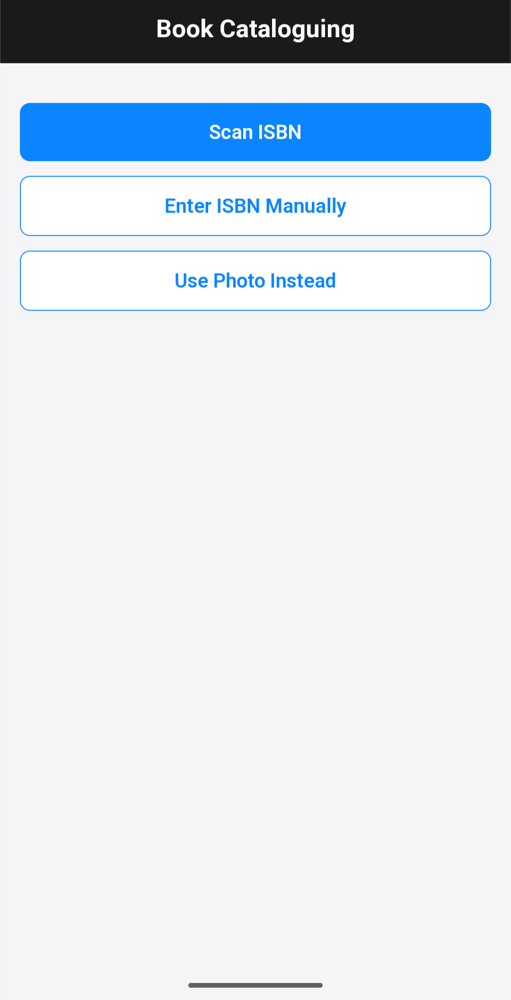
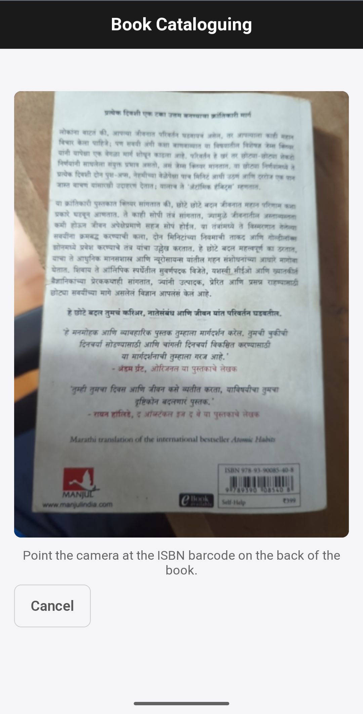
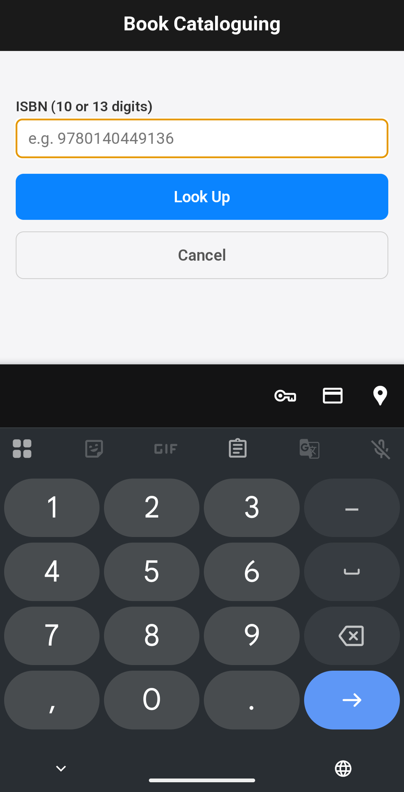
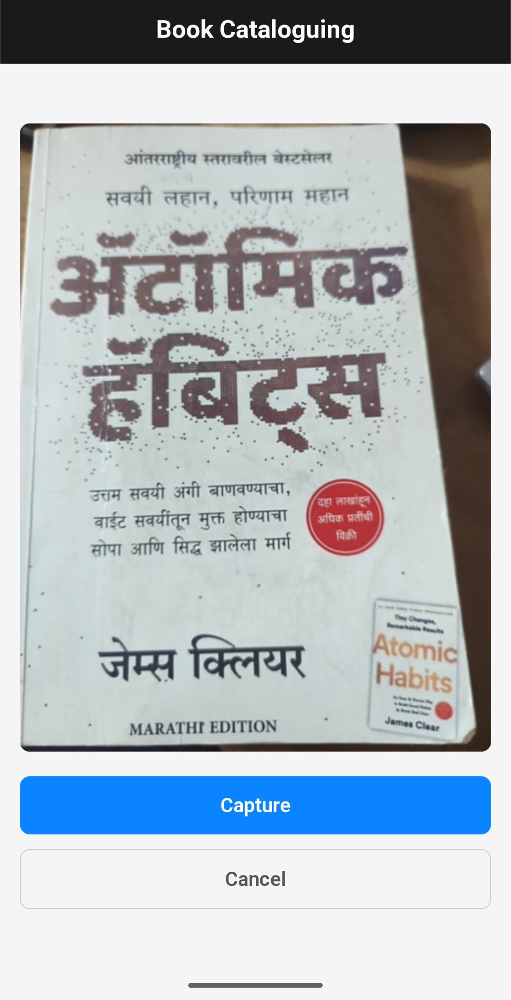
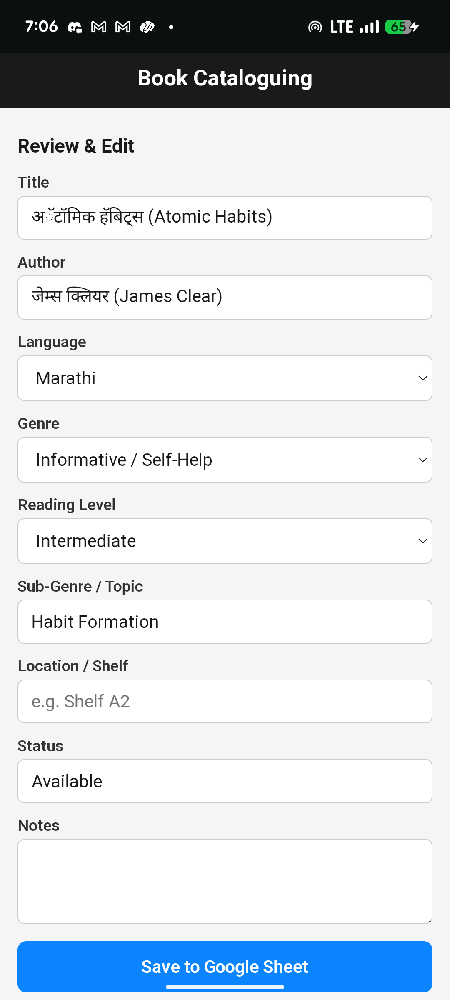

# Book Cataloguing — MVP

A browser-based tool to catalogue books into a Google Sheet. Scan an ISBN with the device camera, fall back to a Gemini Vision cover-photo flow when the ISBN lookup fails, review the result, and save. Runs entirely in the browser on phones or desktop — no app install.

Built for The Apprentice Project (TAP) library cataloguing.

---

## Screenshots

> Drop screenshots into the `screenshots/` folder using the exact filenames below and they will render here automatically. Use your phone to take real screenshots in-app.

### Home screen — three capture options


### ISBN scanner — live camera with barcode overlay


### Manual ISBN entry


### Photo capture — fallback when ISBN doesn't work


### Review & edit screen — verify before saving



---

## How it works

```
┌──────────────┐     ┌──────────────────┐     ┌────────────────┐
│  Phone       │     │  Apps Script     │     │  Google Sheet  │
│  (browser)   │────▶│  Web App         │────▶│  Book Catalogue│
│              │     │  (key kept here) │     │  (your data)   │
└──────┬───────┘     └────────┬─────────┘     └────────────────┘
       │                      │
       │ ISBN found?          │
       ├── yes ──▶ Open Library / Google Books ──▶ form prefilled
       │                      │
       └── no  ──▶ photo ──▶ Apps Script ──▶ Gemini Vision ──▶ form prefilled
```

- **ISBN path** is fast and free — no Gemini call, no quota burn.
- **Photo path** uses Gemini only when ISBN lookup fails or the book has no barcode.
- The Gemini API key never touches the browser; the frontend only ever speaks to your Apps Script Web App URL.

---

## Files

| File | Purpose |
|---|---|
| `index.html` | Page markup, three-screen flow |
| `styles.css` | Mobile-first styling |
| `app.js` | Frontend logic: scanner, ISBN lookup, photo capture, review form |
| `Code.gs` | Google Apps Script backend: sheet writes + Gemini Vision proxy |
| `screenshots/` | App screenshots referenced in this README |

---

## One-time setup

### 1. Create the Google Sheet

1. Create a new Google Sheet.
2. Rename the first tab to **`Book Catalogue`** (or any name you prefer — you'll set it as a property below).
3. The first row should be the header (the script will create it on first save if missing):

   | # | Title | Author | Language | Genre | Reading Level | Sub-Genre / Topic | Location / Shelf | Status | Notes |
   |---|---|---|---|---|---|---|---|---|---|

4. Copy the spreadsheet ID from the URL:
   `https://docs.google.com/spreadsheets/d/<SHEET_ID>/edit`

### 2. Get a Gemini API key

1. Go to <https://aistudio.google.com/apikey>.
2. **Create API key** → copy it.

### 3. Create the Apps Script project

1. Go to <https://script.google.com> → **New project**.
2. Replace the default `Code.gs` contents with this repo's `Code.gs`.
3. Click the **⚙ Project Settings** icon (left sidebar) → scroll to **Script Properties** → add three:

   | Property | Value |
   |---|---|
   | `GEMINI_API_KEY` | *(your Gemini key)* |
   | `SHEET_ID` | *(your spreadsheet ID)* |
   | `SHEET_NAME` | `Book Catalogue` |

4. **Deploy → New deployment → Web app**:
   - Description: `Book Cataloguing`
   - Execute as: **Me**
   - Who has access: **Anyone**
5. Authorize when prompted (needs Sheets + UrlFetch access). On the "Google hasn't verified this app" screen: **Advanced → Go to … (unsafe) → Allow**. Safe because you are the developer.
6. Copy the resulting **Web app URL** — it looks like `https://script.google.com/macros/s/AKfycb.../exec`.

### 4. Wire up the frontend

1. Open `app.js` and replace the `APPS_SCRIPT_URL` constant near the top with your Web App URL.
2. Host the three frontend files somewhere with HTTPS (camera APIs require HTTPS or `localhost`):
   - **Netlify Drop**: drag-drop the folder at <https://app.netlify.com/drop> — instant HTTPS URL.
   - **GitHub Pages**: push the folder to a repo, enable Pages on `main`.
   - **Cloudflare Pages**, **Vercel**, etc.

For local desktop testing:
```powershell
python -m http.server 8080
```
…then open <http://localhost:8080>. Camera works on `localhost`. For phone testing, you need HTTPS.

---

## Usage

1. Open the hosted URL on your phone.
2. **Three ways to start:**
   - **Scan ISBN** — point camera at the back cover barcode.
   - **Enter ISBN Manually** — type the 10- or 13-digit ISBN.
   - **Use Photo Instead** — when the book has no ISBN or it isn't being found.
3. **Review** — verify title/author, pick Language / Genre / Reading Level from dropdowns, fill Location/Shelf, Status, Notes.
4. **Save to Google Sheet** — appends a row with an auto-incremented `#` serial number.

---

## Redeploying after edits

Apps Script web apps are version-locked. **Whenever you edit `Code.gs`:**

1. Click **Deploy → Manage deployments**.
2. Click the **✏ pencil icon** on your existing deployment.
3. **Version: New version** → **Deploy**.

The Web App URL stays the same, so the frontend keeps working.

> **Script Properties** are read live — changes to those take effect immediately, no redeploy needed.

---

## FAQ

### Do users need to install anything?
No. It's a regular webpage. Open the URL in any modern phone or desktop browser.

### Which browsers work?
Chrome, Edge, Safari, Firefox — anything from the last 3 years. Camera access requires HTTPS.

### What languages does it support cataloguing?
The Language dropdown is fixed to **Marathi, English, Hindi**. The ISBN lookup and Gemini OCR can read books in any script, but the catalogued `Language` field must be one of those three.

### Is my Gemini API key safe?
Yes. The key is stored in Apps Script's Script Properties, server-side. The frontend only ever calls your Web App URL — the Gemini key is never sent to the browser.

### How does the serial number (`#`) work?
The script scans column A, finds the highest numeric serial in the existing rows, and writes the new entry as `(max + 1)` in the row immediately after it. Manually-added books are honored — start typing in the app and it picks up from your existing numbering.

### What if the ISBN scanner can't read a barcode?
Try **Enter ISBN Manually** — the 13-digit number is usually printed right next to the barcode. If even that fails (book has no ISBN, e.g. old or self-published), use **Use Photo Instead**.

### What if Open Library / Google Books have no record for the ISBN?
You'll see "No metadata found." Tap **Use Photo Instead** and the Gemini path will take over.

### Can I edit the data before saving?
Yes — every field on the review screen is editable. Gemini's output is a starting point, not a commitment.

### Does this work offline?
No. It needs internet for ISBN lookup, Gemini, and writing to the Sheet.

### Can multiple people use the same deployment at once?
Yes. The Apps Script Web App handles concurrent requests. Each user just opens the hosted URL.

### How much does Gemini cost?
- **Free tier**: ~250 requests/day on `gemini-2.5-flash-lite`, ~250/day on `gemini-2.5-flash`. Per-minute caps (10–15 RPM) reset every 60 seconds.
- **Paid**: roughly $0.0001 per cover photo. Cataloguing 1000 books costs around ₹0.85 total. Honestly cheaper than worrying about quotas.

### Can I add or change the dropdown values (Genre, Language, Reading Level)?
Yes — edit the `<option>` tags in `index.html` and the matching lists in:
- `app.js` (`normalizeAllowed` calls in `useCapturedPhoto`)
- `Code.gs` (the prompt in `geminiVision`)

All three should match. The Gemini prompt enforces only-allowed values at the model side.

### Can I change the sheet's columns?
Yes, but it's a coordinated change:
1. Update the header in your Sheet.
2. Update `COLUMNS` in `Code.gs`.
3. Update the `appendRow` / `setValues` call in `Code.gs` to match the new column order.
4. Add matching `<input>` / `<select>` to `index.html` and corresponding `f-…` fields in `app.js`'s `populateForm` and `saveRow`.

---

## Troubleshooting

### "Saved!" appears but nothing shows up in the Sheet
**Cause:** almost always one of:
- **Wrong tab:** your `SHEET_NAME` script property doesn't exactly match a real tab in the Sheet. The script silently creates a new tab with that name. Check the tab bar at the bottom of your Sheet for unexpected tabs.
- **Stale deployment:** you edited `Code.gs` but didn't deploy a new version. See *Redeploying after edits*.
- **Stale browser tab:** Google Sheets sometimes caches. Hard-refresh with **Ctrl+Shift+R** (Cmd+Shift+R on Mac).

To pinpoint: open Apps Script → **⏱ Executions** (left sidebar) → click the most recent `doPost` row → check **Logs**. The script logs the spreadsheet name, all tab names, and the exact row it wrote to.

### Row goes to the very bottom of the sheet instead of after the last data row
**Cause:** stray content somewhere far below your data block was confusing `appendRow`. **Already fixed** — the script now anchors on column A and writes directly after the last numeric serial number.

### "Gemini error: Gemini HTTP 429"
**Cause:** quota exhausted.
- **Per-minute (RPM)**: wait 60 seconds, try again.
- **Per-day (RPD)**: resets at midnight US-Pacific.

Fixes, in order of effort:
1. Switch model to `gemini-2.5-flash-lite` in `Code.gs:109` (most generous free tier).
2. Enable billing on the API key — paid tier gives 1000 RPM and is virtually free at this volume.
3. Batch multiple photos per request (one Gemini call for N books).

### "Could not start camera" / "Could not access camera"
**Cause:** either the page is on `http://` (not localhost) or the user denied camera permission.
- Make sure the hosted URL starts with `https://`.
- In Chrome on phone: tap the padlock in the address bar → Permissions → allow Camera → reload.

### Scanner shows live camera but never detects a barcode
**Try:**
- Better lighting; barcodes need contrast.
- Hold the phone ~15 cm from the barcode, parallel to it.
- If it still won't work, use **Enter ISBN Manually**.

### "SHEET_ID script property not set" / "GEMINI_API_KEY script property not set"
You added the value to a comment in `Code.gs` instead of to Script Properties. Go to Apps Script → **⚙ Project Settings → Script Properties** → add the missing property → **Save script properties**. No redeploy needed (Script Properties read live).

### "This endpoint requires POST" error appears in the app
**Cause:** the browser downgraded your POST to GET (a redirect/CORS edge case). Specifically: an Apps Script `/exec` URL does a 302 redirect to `script.googleusercontent.com`; in rare setups the body is stripped. The frontend uses `Content-Type: text/plain` to avoid this, which works in 99% of cases.

**Workarounds if it happens:**
- Try a different browser.
- Confirm the deployment is set to **Who has access: Anyone**.
- As a last resort, set `redirect: "follow"` and use `mode: "cors"` explicitly in `fetch()` calls in `app.js`.

### Open Library API hangs or returns nothing
Open Library is a free community service; it occasionally has slow days. The code falls back to Google Books automatically. If both fail, use the photo path.

### "Cannot read properties of undefined (reading 'contents')" in Executions
You called the Web App via GET (e.g. opened the URL in a browser tab) but `doPost` ran. Usually transient — only matters if your real frontend POST is failing. Open DevTools → Network and inspect the actual request.

### Camera works on laptop but not on phone
The phone is almost certainly on `http://` instead of `https://`. Local IPs like `192.168.x.x:8080` are not HTTPS. Use Netlify Drop or another HTTPS host.

### Apps Script asks for authorization every time
Make sure deployment is set to **Execute as: Me** (not "User accessing the app"). With "Me", *you* authorize once and all users go through your auth context — they don't need a Google account.

---

## Maintenance checklist

- **Rotate the Gemini API key** every 6 months: regenerate at <https://aistudio.google.com/apikey>, update the `GEMINI_API_KEY` Script Property, no redeploy needed.
- **Back up the Sheet** monthly: File → Download → Excel/CSV.
- **Watch quota usage**: <https://aistudio.google.com/usage> for Gemini.

---

## Security model

- Gemini API key: lives only in Apps Script Script Properties. Never sent to the browser. Not in any committed file.
- Sheet ID: same.
- Web App URL: public (anyone with the link can save rows). If this matters, switch deployment access from **Anyone** to **Anyone with Google account** and require sign-in — but you'll lose the no-friction phone experience.
- Frontend has no auth. Anyone who can reach the hosted URL can add books. Acceptable for a closed library cataloguing tool; not acceptable for anything user-data-sensitive.

---

## Credits

Built for The Apprentice Project (TAP). Uses:
- [ZXing-js](https://github.com/zxing-js/library) — barcode scanning, MIT
- [Open Library API](https://openlibrary.org/developers/api) — ISBN lookups, free
- [Google Books API](https://developers.google.com/books) — ISBN fallback, free
- [Gemini API](https://ai.google.dev/) — cover-photo OCR + classification
- [Google Apps Script](https://script.google.com/) — backend
# Book-Cataloguing

